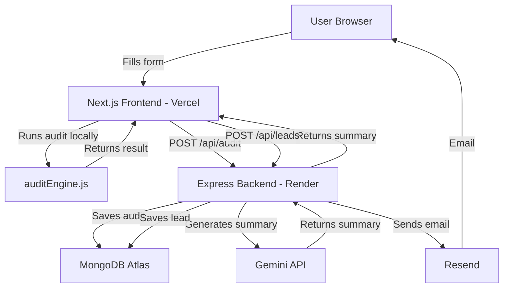

# Architecture

## System Diagram

## Data Flow

1. User fills spend form on Next.js frontend
2. Click "Run Audit" → `auditEngine.js` runs 
   instantly in browser — no API call needed
3. Result saved to localStorage, user navigated 
   to `/audit/[id]`
4. Frontend POSTs audit to Express backend → 
   saved to MongoDB
5. Frontend fetches summary from Express → 
   Express calls Gemini API → returns 100-word 
   summary
6. User submits email → Express saves lead to 
   MongoDB → Resend sends confirmation email

## Stack Choice

- **Next.js** — App Router gives server-side OG 
  tags for shareable URLs, built-in routing, 
  and React in one package
- **Express** — Simple, lightweight, full control 
  over API routes
- **MongoDB Atlas** — Document storage fits 
  audit results naturally, flexible schema 
  helped iterate fast in 7 days
- **React Bootstrap** — Already knew it, faster 
  than learning Tailwind in 7 days
- **Vercel + Render** — Both have free tiers and 
  auto-deploy on git push
- **JavaScript (not TypeScript)** — All my 
  full-stack projects are built in JavaScript. 
  Chose familiarity over TypeScript to move 
  faster in a 7-day window without fighting 
  type errors while learning a new framework.

## What I'd Change for 10k Audits/Day

- Add Redis caching for audit results so repeat 
  shareable URL visits don't hit MongoDB every time
- Move Gemini summary generation to a queue 
  (Bull/BullMQ) so it doesn't block the API response
- Add MongoDB indexes on auditId and email fields
- Rate limiting per user not just per IP
- CDN for static assets on Vercel (already handled)