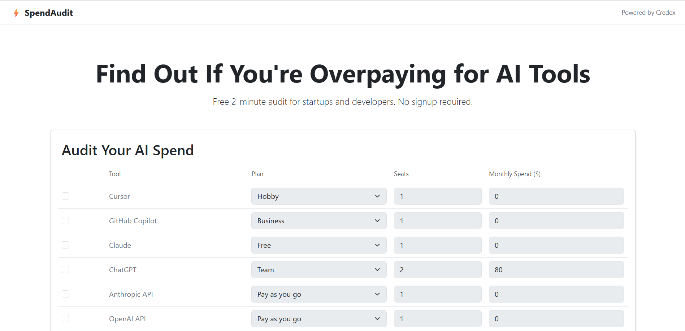
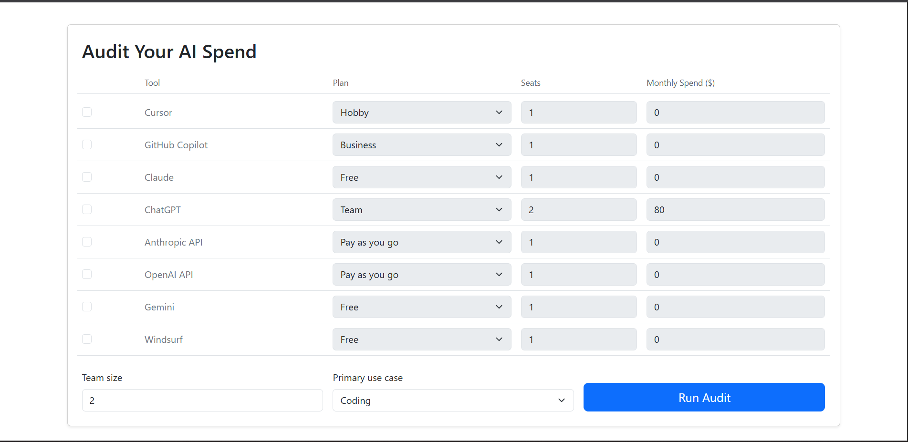
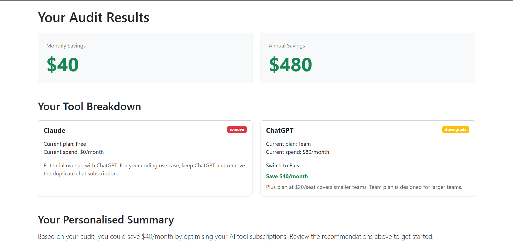
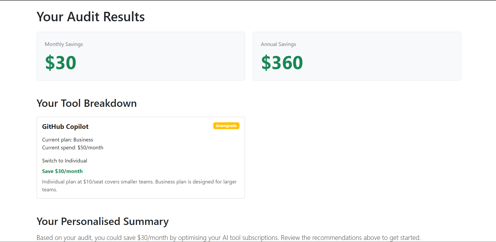
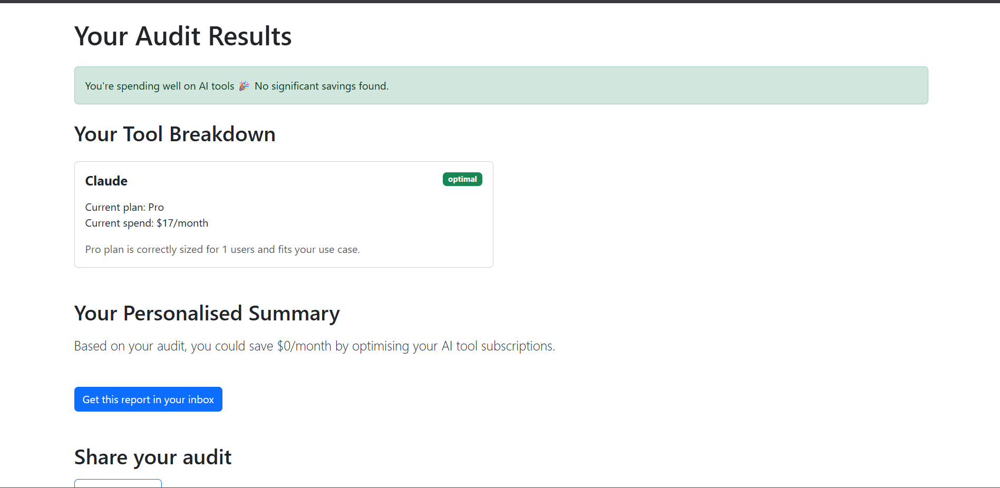
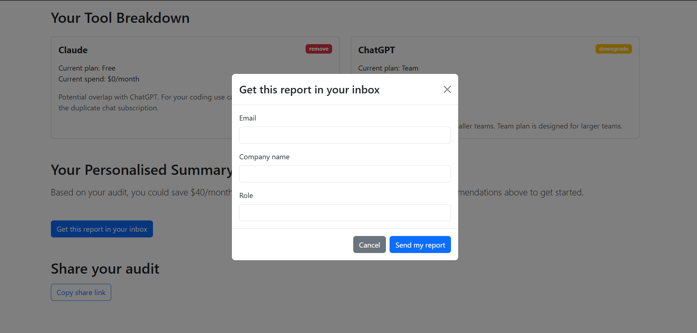
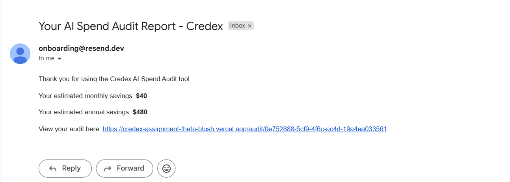

# SpendAudit — AI Spend Audit Tool

> Free 2-minute AI tool spend auditor for startups 
> and developers. Find where you're overpaying, 
> what to switch, and how much you can save.

**Live URL:** https://credex-assignment-theta-blush.vercel.app

Built as a Round 1 submission for Credex — a company 
that sells discounted AI infrastructure credits. 
SpendAudit is the free lead generation tool that 
surfaces real overspend and positions Credex as 
the solution.

---

## Screenshots

### Landing Page


### Full Form with All 8 AI Tools


### Audit Results — Savings Found


### Audit Results — Savings Found


### Audit Results — Already Optimal


### Lead Capture Modal


### Email Confirmation


---

## What It Does

A cold visitor lands on the page, inputs their 
AI tool subscriptions (which plan, how many seats, 
monthly spend), and instantly gets:

1. **Total monthly and annual savings** — big, 
   clear, at the top
2. **Per-tool breakdown** — current plan, 
   recommended action, savings amount, and a 
   one-sentence reason
3. **AI-generated personalised summary** — 
   100-word summary via Gemini API with fallback
4. **Email report** — lead capture after value 
   shown, never before
5. **Shareable URL** — unique public link per 
   audit with Open Graph tags

---

## Features

### 1. Spend Input Form
- Supports 8 AI tools: Cursor, GitHub Copilot, 
  Claude, ChatGPT, Anthropic API, OpenAI API, 
  Gemini, Windsurf
- For each tool: plan dropdown, seats, monthly spend
- Team size and primary use case fields
- Form state persists across page reloads via 
  localStorage — never lose your input

### 2. Audit Engine (5 Rules)
All logic runs instantly in the browser — no 
API call needed for the audit itself:

- **Rule 1 — Wrong plan for team size:** 
  2 seats on a Business plan → recommend Pro. 
  5+ seats on Individual → recommend Business.
- **Rule 2 — Overpaying vs official price:** 
  If your entered spend exceeds official price 
  × seats → flag the difference.
- **Rule 3 — Coding tool overlap:** 
  Cursor + GitHub Copilot + Windsurf doing the 
  same job → keep one based on use case.
- **Rule 4 — LLM tool overlap:** 
  ChatGPT + Claude for same use case → 
  recommend keeping the better fit.
- **Rule 5 — Already optimal:** 
  If no issues found → honest "You're spending 
  well" message. No manufactured savings.

### 3. Audit Results Page
- Monthly and annual savings displayed prominently
- Per-tool cards with status badges 
  (optimal / downgrade / remove / overpaying)
- Credex consultation CTA for audits showing 
  >$500/month savings
- Honest "spending well" message for optimal users

### 4. AI Personalised Summary
- Gemini API generates a ~100-word summary 
  based on your specific audit data
- Graceful fallback to templated summary if 
  API fails — results page never breaks

### 5. Lead Capture + Email
- Email gate shown AFTER results, never before
- Optional fields: company name, role
- Stored in MongoDB Atlas
- Transactional email via Resend with audit 
  link and savings summary
- Honeypot spam protection
- Rate limiting (10 audits/15min, 5 leads/hour)

### 6. Shareable Result URL
- Every audit gets a unique UUID-based URL
- Public version strips PII (email, company name)
- Open Graph + Twitter Card meta tags for 
  clean link previews
- "Copy share link" button with 2-second 
  "Copied!" confirmation

---

## Tech Stack

| Layer | Technology |
|-------|------------|
| Frontend | Next.js 14 (App Router), JavaScript |
| UI | React Bootstrap |
| Backend | Express.js, Node.js |
| Database | MongoDB Atlas (Mongoose) |
| AI Summary | Google Gemini API |
| Email | Resend |
| Frontend Deploy | Vercel |
| Backend Deploy | Render |
| CI/CD | GitHub Actions |
| Tests | Jest + Babel |

---

## Project Structure
credex-assignment/
├── client/                 # Next.js frontend
│   └── src/
│       ├── app/
│       │   ├── page.js     # Landing + form
│       │   └── audit/[id]/ # Results page
│       ├── components/
│       │   ├── SpendForm/
│       │   ├── AuditResults/
│       │   └── LeadCapture/
│       ├── lib/
│       │   ├── auditEngine.js   # Core audit logic
│       │   └── pricingData.js   # All pricing constants
│       └── hooks/
│           └── useFormPersistence.js
├── server/                 # Express backend
│   └── src/
│       ├── routes/         # audit.js, leads.js
│       ├── models/         # Audit.js, Lead.js
│       ├── services/       # geminiService, emailService
│       └── middleware/     # rateLimiter
├── tests/                  # Jest audit engine tests
├── .github/workflows/      # CI pipeline
└── *.md                    # All required docs

---

## Quick Start

### Run Locally

```bash
# Clone the repo
git clone https://github.com/Mayank-Bhatt-014/Credex-Assignment.git
cd Credex-Assignment

# Frontend
cd client
npm install
npm run dev
# Runs on http://localhost:3000

# Backend (new terminal)
cd server
npm install
npm run dev
# Runs on http://localhost:5000
```

### Environment Variables

**client/.env.local:**
NEXT_PUBLIC_API_URL=http://localhost:5000

**server/.env:**
MONGODB_URI=your_mongodb_atlas_uri
GEMINI_API_KEY=your_gemini_api_key
RESEND_API_KEY=your_resend_api_key
FROM_EMAIL=onboarding@resend.dev
FRONTEND_URL=http://localhost:3000

### Run Tests
```bash
cd tests
npm install
npx jest auditEngine.test.js
```

Expected output:
PASS ./auditEngine.test.js
runAudit
✓ flags GitHub Copilot as remove when Cursor
is active for coding use case
✓ recommends downgrade when seats <= 2 on
Business plan
✓ flags overpaying when spend exceeds
official price
✓ returns optimal when spend matches
official price
✓ skips inactive tools completely
Tests: 5 passed, 5 total

### Deploy
- **Frontend:** Connect GitHub repo to Vercel, 
  set root directory to `client`, add 
  `NEXT_PUBLIC_API_URL` environment variable
- **Backend:** Connect GitHub repo to Render, 
  set root directory to `server`, start command 
  `node src/index.js`, add all environment variables

---

